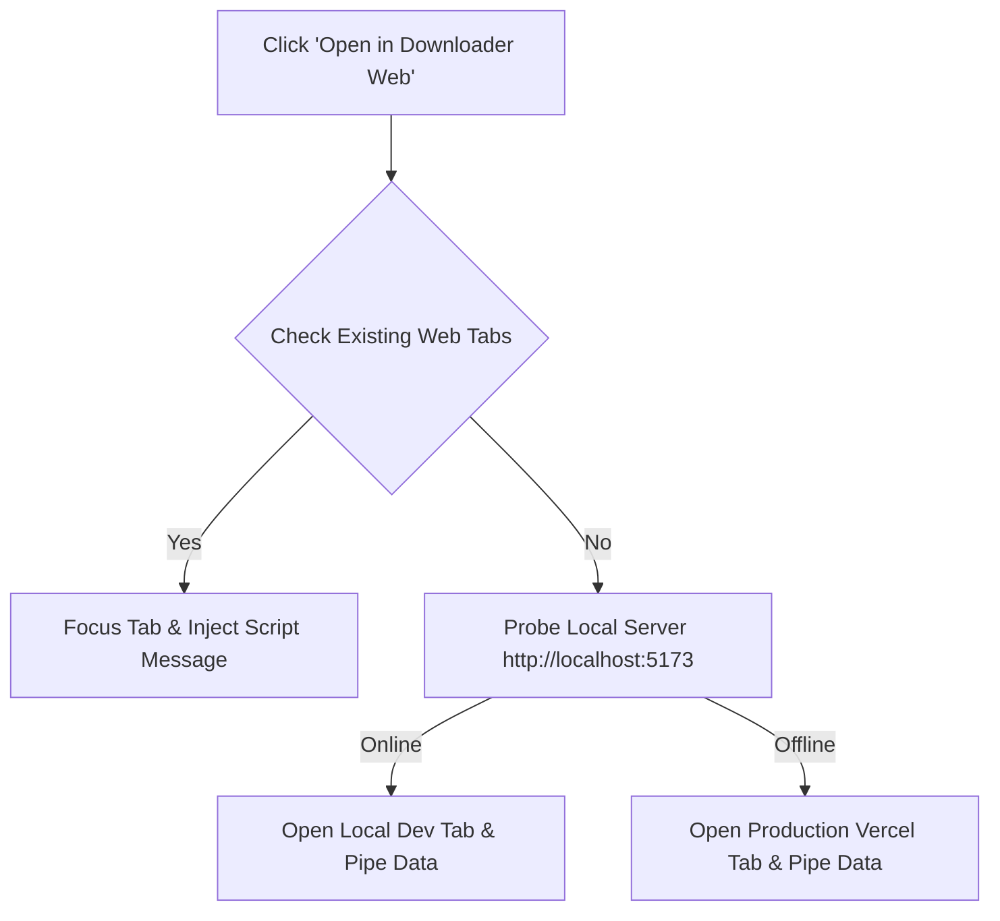

<div align="center">


# 📥 Downloader


**A premium, high-performance video & audio extractor featuring a WebGL 3D particle network and a companion Chrome Extension**

[](https://github.com/dominhduy09/Downloader)
[](LICENSE)
[](https://downloader-topaz-eta.vercel.app/)
[](CONTRIBUTING.md)

[Features](#-features) • [Installation](#-installation) • [How It Works](#-how-it-works) • [Tech Stack](#-tech-stack) • [Contributing](#-contributing)

</div>

---

## 📋 Table of Contents

- [Overview](#-overview)
- [Features](#-features)
- [How It Works](#-how-it-works)
- [Project Structure](#-project-structure)
- [Installation](#-installation)
- [Vercel Deployment](#-vercel-deployment)
- [Tech Stack](#-tech-stack)
- [Contributing](#-contributing)
- [Support](#-support)
- [Author](#-author)
- [License](#-license)

---

## 🎯 Overview

**Downloader** is a unified media extraction workspace combining a modern, interactive React web application and a companion Google Chrome / Microsoft Edge extension (Manifest V3). 

The web client offers single video downloading, channel/playlist browsing, and bulk ZIP exports wrapped inside a premium, glassmorphic layout backed by a 3D WebGL particle constellation. The helper browser extension allows users to pipe current tab links straight into their extraction form with a single click.

---

## ✨ Features

### Web Application UI & UX
- 🌌 **WebGL Particle Network** — Interactive 3D particle constellation powered by Three.js with responsive mouse-move parallax sway animation.
- 💎 **Liquid Glass Theme** — Premium custom frosted glassmorphic cards, navigations, and buttons with rich backdrop-blur parameters.
- 🌐 **i18n Localization** — Comprehensive language translation system supporting **English (EN)**, **Spanish (ES)**, **Vietnamese (VI)**, **French (FR)**, and **Japanese (JA)**.
- 🔔 **Changelog Updates Popover** — A dewy drop-down card triggered by the header bell icon displaying translated v1.2.0 upgrade logs.
- ⏱️ **Live Connectivity Pinger** — Dynamic status checker in the footer copyright bar displaying translated connection statuses (`Operational`, `Checking`, `Offline`) along with network pings in milliseconds.

### Companion Browser Extension
- ⚡ **Single-Click Extraction** — Send active tabs straight into your web downloader dashboard instantly.
- 🎨 **Visual Consistency** — Styled matching the website's brand colors, Inter typography scale, button shadows, and flat logo containers.
- 🔀 **Dynamic Host Routing** — Queries if your local Vite server (`localhost:5173`) is active; if online, it redirects to local, otherwise it falls back to the Vercel production deployment automatically.
- 🔒 **MV3 Persistence** — Prevents Service Worker wake-up dropouts and popup closing race conditions by utilizing message acknowledgments.

---

## 🔧 How It Works

### Extension Redirection Dispatcher


- When you click the **Open in Downloader Web** button, the popup sends a message to the service worker worker thread and waits for confirmation before shutting.
- The service worker checks your open tabs. If a web app instance is open (local or production), it brings it into focus.
- If no tabs exist, the service worker sends a fast `HEAD` request to `http://localhost:5173/`. 
  - If active, it opens the local site.
  - If closed, it redirects to `https://downloader-topaz-eta.vercel.app/`.
- Once loaded, the extension injects a script post-message (`DOWNLOAD_URL`) which the React application processes to begin automatic metadata extraction.

---

## 📂 Project Structure

```text
Downloader/
├── web/                 # Vite + React + Tailwind CSS Web Application
│   ├── index.html       # HTML entry point (title & font parameters)
│   ├── vercel.json      # Routing rewrites for Single Page App fallbacks
│   ├── src/
│   │   ├── components/
│   │   │   └── ThreeBg.jsx   # Three.js 3D Interactive Particle network canvas
│   │   ├── context/
│   │   │   └── LanguageContext.jsx # i18n context state and t() helper functions
│   │   ├── translations.js   # Translations dictionary for the 5 active languages
│   │   ├── App.jsx           # Extractor logic views, topbars, and live footers
│   │   ├── index.css         # Styling system overlays and dewy filters
│   │   └── main.jsx          # Entry point loading context providers
│
└── extension/           # Chrome / Edge Extension (Manifest V3)
    ├── manifest.json    # Extension manifest with vercel host permissions
    ├── popup.html       # Inter-styled layout popup
    ├── popup.js         # Dispatches links and listens for confirmation
    ├── background.js    # service worker checking localhost connectivity
    └── icon.png         # Solid violet brand logo asset
```

---

## 📥 Installation

### 1. Run the Web Application locally
Make sure you have Node.js installed, then execute:

```bash
# Navigate to web folder
cd web

# Install dependencies
npm install

# Run Vite dev server
npm run dev
```
Open **[http://localhost:5173/](http://localhost:5173/)** to view your local web application.

### 2. Install the Browser Extension
1. Open Google Chrome or Microsoft Edge and navigate to the extension settings page:
   - Chrome: `chrome://extensions/`
   - Edge: `edge://extensions/`
2. Enable **Developer Mode** (toggle switch in the dashboard corner).
3. Click the **Load unpacked** button.
4. Select the **`extension/`** directory in this repository.
5. Pin the extension to your browser toolbar.

---

## 🚀 Vercel Deployment

This project is optimized for Vercel deployment. Since it is a Single Page Application (SPA), Vercel must rewrite manual routing updates back to `index.html` to prevent `404` errors. This is configured automatically inside [`web/vercel.json`](file:///Users/dominhduy/Desktop/Downloader/web/vercel.json):

```json
{
  "rewrites": [
    {
      "source": "/(.*)",
      "destination": "/index.html"
    }
  ]
}
```

To deploy to Vercel, push the repository to GitHub, link it on your Vercel Dashboard, set the **Root Directory** to `web`, and deploy.

---

## 🛠️ Tech Stack

### Web Application
- **Vite** — Fast, modern frontend build tool.
- **React 19** — Single-page application rendering.
- **Tailwind CSS** — Utility-first styling framework.
- **Three.js** — GPU-accelerated WebGL graphics.
- **Lucide React** — Premium SVG icons.

### Companion Extension
- **Manifest V3** — Modern browser extensions framework.
- **Chrome Extensions API** — Tab manipulation, scripting, context menus, and storage.

---

## 🤝 Contributing

Contributions are welcome! Please read the [CONTRIBUTING.md](CONTRIBUTING.md) for details on our code of conduct, development setup, and process for submitting pull requests.

---

## 💖 Support

If you find this downloader useful, consider supporting the project:

- ⭐ **Star this repository** on GitHub
- ☕ **Buy me a coffee** via [PayPal](https://paypal.me/dominhduy09)

---

## 👤 Author

Minh Duy Do

- GitHub: [dominhduy09](https://github.com/dominhduy09)
- Email: [dominhduy09@gmail.com](mailto:dominhduy09@gmail.com)

---

## 📜 License

This project is licensed under the MIT License - see the [LICENSE](LICENSE) file for details.
